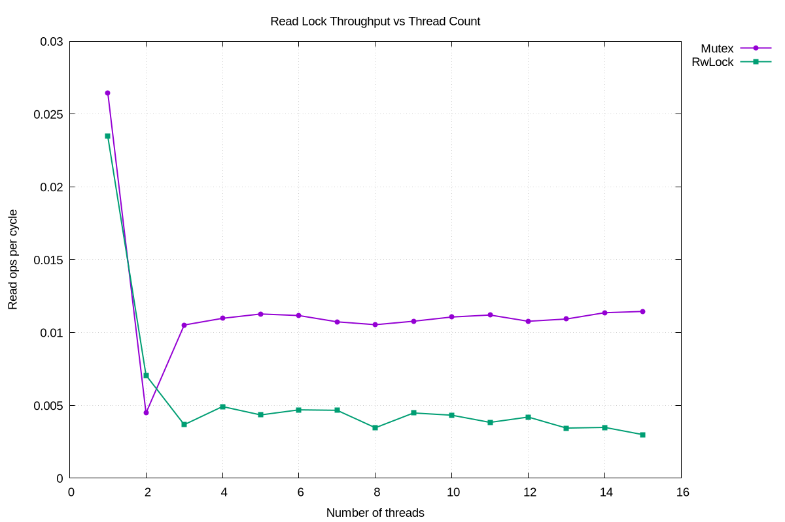

## Info
A benchmark inspired by [this Jon Gjengset talk](https://www.youtube.com/watch?v=tND-wBBZ8RY).

## The Results

## Running Locally
If you have Rust (and `cargo`) installed and you're using a Linux machine running an Amd64 CPU, just run `make` to generate the `read_ops_per_cycle.png` file.
You'll also need GNU `make` and `gnuplot`.
